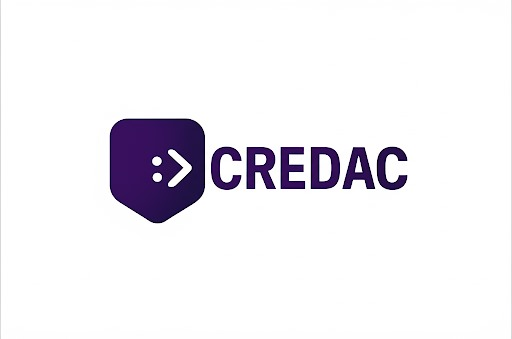

# CREDAC - Lenguaje de Programación

<div align="center">
  
</div>

CREDAC es un lenguaje de programación moderno y fácil de usar que compila a código C++ ejecutable. ¡No necesitas conocimientos previos de compiladores o herramientas complejas!

## 🚀 ¿Qué es CREDAC?

CREDAC es un lenguaje diseñado para ser:
- **Fácil de aprender:** Sintaxis intuitiva y clara
- **Rápido:** Se compila a código C++ optimizado
- **Simple:** Un solo comando ejecuta todo el proceso
- **Potente:** Programación orientada a objetos, funciones, y más
- **Visual:** Extensión personalizada para Visual Studio Code

## 📋 ¿Qué necesitas instalar?

Solo necesitas 3 cosas básicas:

### 1. **Visual Studio Code**
- Descarga desde: [https://code.visualstudio.com/](https://code.visualstudio.com/)
- Es el editor recomendado con soporte completo para CREDAC

### 2. **Java JDK 21 o superior**
- Descarga desde: [Oracle JDK](https://www.oracle.com/java/technologies/downloads/)
- O usa OpenJDK desde tu gestor de paquetes

### 3. **Compilador C++ (g++)**
- **Windows:** Instala MinGW o usar Git Bash
- **Ubuntu/Linux:** `sudo apt install g++`
- **macOS:** `xcode-select --install`

## 📦 Instalación de CREDAC

### Paso 1: Descargar CREDAC
```bash
git clone https://github.com/daciaespinoza/cgcredac.git
cd cgcredac
```

### Paso 2: Dar permisos de ejecución
En la terminal, dentro de la carpeta del proyecto, ejecuta:
```bash
chmod +x ejecutar.sh
```
*Nota: Solo necesitas hacer esto una vez por terminal/sistema.*

### Paso 3: ¡Listo para usar!
No necesitas compilar nada más. Todo viene precompilado y listo.

### Paso 3: Instalar la extensión de VS Code (Recomendado)

Para la mejor experiencia de desarrollo:

1. **Encuentra la extensión:** Busca el archivo `credac-language-support-0.0.1.vsix` en el repositorio

2. **Instala en VS Code:**
   - Abre Visual Studio Code
   - Haz clic derecho sobre `credac-language-support-0.0.1.vsix`
   - Selecciona **"Install Extension VSIX"**
   - Reinicia VS Code

3. **Instala el tema After Dark (Opcional pero recomendado):**
   - Ve a Extensions (Ctrl+Shift+X)
   - Busca "After Dark"
   - Instala el tema
   - Ve a File > Preferences > Color Theme
   - Selecciona "After Dark"

¡Ahora tendrás resaltado de sintaxis completo para archivos `.dec`! 🎨

## 🎯 Tu primer programa en CREDAC

### Paso 1: Crear tu archivo
1. Abre Visual Studio Code
2. Crea un archivo llamado `ejemplo.dec` en la carpeta del proyecto
3. Escribe tu código CREDAC

### Paso 2: Ejecutar tu programa
Abre la terminal en la carpeta del proyecto y ejecuta:

```bash
./ejecutar.sh
```

¡Eso es todo! El script automáticamente:
- ✅ Compila tu código CREDAC
- ✅ Genera el código C++
- ✅ Compila el ejecutable
- ✅ Ejecuta tu programa

## 💡 Ejemplos de CREDAC

### Ejemplo Básico
Crea un archivo `ejemplo.dec` con este contenido:

```credac
comenzar
  mostrar "¡Hola mundo desde CREDAC!"::
  
  crear como entero edad igual a 25::
  mostrar "Mi edad es:", edad::
terminar
```

### Ejemplo Avanzado - Sistema de Estudiantes
```credac
clase Estudiante {
  privado atributo nombre como texto::
  privado atributo nota1 como decimal::
  privado atributo nota2 como decimal::
  privado atributo promedio como decimal::
  
  publico metodo asignar_datos(texto nombre_param, decimal nota_param1, decimal nota_param2) {
    este.nombre igual a nombre_param::
    este.nota1 igual a nota_param1::
    este.nota2 igual a nota_param2::
    este.promedio igual a (nota_param1 + nota_param2) / 2::
  }
  
  publico metodo mostrar_info() {
    mostrar "Estudiante:", este.nombre::
    mostrar "Promedio:", este.promedio::
  }
}

funcion evaluar_beca(decimal promedio) retornar texto {
  si (promedio mayor que 80) {
    retornar "Beca aprobada"::
  } sino {
    retornar "No aplica para beca"::
  }
}

comenzar
  crear como Estudiante estudiante1::
  crear como texto nombre::
  crear como decimal nota1, nota2::
  
  mostrar "Ingrese el nombre del estudiante:"::
  leer nombre::
  mostrar "Ingrese la primera nota:"::
  leer nota1::
  mostrar "Ingrese la segunda nota:"::
  leer nota2::
  
  estudiante1.asignar_datos(nombre, nota1, nota2)::
  estudiante1.mostrar_info()::
terminar
```

Luego ejecuta:
```bash
./ejecutar.sh
```

## 📝 Reglas de Estilo de CREDAC

### 🔤 Reglas Generales

- **Idioma:** El código debe escribirse en español sencillo
- **Sin tildes:** Las palabras reservadas no llevan tildes aunque gramaticalmente las necesiten
  - ✅ Correcto: `logico`, `mostrar`
  - ❌ Incorrecto: `lógico`, `mostrár`
- **Una línea por instrucción:** Cada instrucción debe ocupar idealmente una sola línea
- **Delimitador obligatorio:** Todas las instrucciones deben terminar con `::` 
- **Llaves siempre:** Las estructuras de control (`si`, `sino`, `mientras`, `para`) deben usar llaves `{}` incluso para una línea
- **Estructura del programa:**
  - Todo programa debe iniciar con `comenzar` y finalizar con `terminar`
  - Estas palabras van sin sangría (alineadas a la izquierda)
  - Todo el contenido entre ellas debe tener sangría de **dos espacios**

### 🏷️ Nombres de Variables

#### ✅ Reglas para Variables
- **Minúsculas:** Siempre escribir en minúsculas
- **Snake_case:** Si hay varias palabras, sepáralas con guiones bajos
- **Nombres descriptivos:** Usa nombres que expliquen su propósito
- **Máximo 30 caracteres:** Longitud recomendada

#### ✅ Ejemplos Correctos
```credac
crear como entero edad igual a 25::
crear como texto nombre_usuario igual a "Juan"::
crear como decimal total_ventas igual a 1500.50::
crear como entero cantidad_productos igual a 10::

// Variables para contadores
crear como entero i igual a 0::
crear como entero j igual a 0::
```

#### ❌ Nombres Prohibidos
- No iniciar con números: `1edad`, `2contador`
- No usar caracteres especiales: `@edad`, `#total`, `$precio`, `%descuento`
- No usar guiones normales: `edad-estudiante` (usar `edad_estudiante`)

### 🔒 Nombres de Constantes

- **MAYÚSCULAS:** Escribir completamente en mayúsculas
- **Snake_case:** Separar palabras con guiones bajos
- **Declarar al inicio:** Antes de cualquier cálculo o uso

#### ✅ Ejemplos Correctos
```credac
comenzar
  constante como entero LIMITE igual a 100::
  constante como decimal PI igual a 3.14159::
  constante como texto MENSAJE_BIENVENIDA igual a "¡Hola!"::
terminar
```

### 🔧 Nombres de Funciones

- **Minúsculas:** Siempre en minúsculas
- **Snake_case:** Separar palabras con guiones bajos
- **Iniciar con verbo:** Empezar con una acción seguida de lo que hace

#### ✅ Ejemplos Correctos
```credac
funcion calcular_area() retornar decimal {
  // código aquí
}

funcion leer_datos() {
  // código aquí
}
```

#### ❌ Ejemplos No Recomendados
```credac
// Muy abreviado y poco claro
funcion calcArea() { }
funcion escrOpc() { }

// No inicia con verbo
funcion area_triangulo() { }
```

### 📐 Ejemplo de Código Bien Estructurado

```credac
comenzar
  // Constantes al inicio
  constante como decimal PI igual a 3.14159::
  constante como entero EDAD_MINIMA igual a 18::
  
  // Variables descriptivas
  crear como entero edad_usuario igual a 0::
  crear como texto nombre_completo igual a ""::
  crear como decimal precio_total igual a 0.0::
  
  // Lectura de datos
  mostrar "Ingrese su edad:"::
  leer edad_usuario::
  
  // Estructura clara con llaves
  si (edad_usuario mayor o igual que EDAD_MINIMA) {
    mostrar "Acceso permitido"::
  } sino {
    mostrar "Acceso denegado"::
  }
  
  // Uso del delimitador ::
  mostrar "Programa finalizado"::
terminar
```

### 💡 Consejos Importantes

1. **Sé descriptivo:** `edad_estudiante` es mejor que `edad` o `e`
2. **Mantén consistencia:** Si usas `nombre_usuario`, no mezcles con `nombreCompleto`
3. **Piensa en español:** Las variables deben leerse naturalmente en español
4. **Usa el delimitador:** Nunca olvides el `::` al final de cada instrucción
5. **Sangría correcta:** Dos espacios para todo lo que esté dentro de `comenzar...terminar`

## 🚨 Solución de problemas comunes

### ❌ Error: "g++ no se reconoce como comando"
**Solución:** Java no está instalado o no está en el PATH
- Instala JDK 21 o superior
- Verifica con: `java -version`

### ❌ Error: "Permission denied" al ejecutar ./ejecutar.sh
**Solución:** El archivo no tiene permisos de ejecución
```bash
chmod +x ejecutar.sh
```
*Solo necesitas hacer esto una vez por sistema.*
### ❌ Error: "java no se reconoce como comando"
**Solución:** Java no está instalado o no está en el PATH
- Instala JDK 21 o superior
- Verifica con: `java -version`

**Solución:** g++ no está instalado
- **Windows:** Instala MinGW o usa Git Bash
- **Linux:** `sudo apt install g++`
- **macOS:** `xcode-select --install`
### ❌ Error: "No such file ejemplo.dec"
**Solución:** 
- Asegúrate de que tu archivo se llame exactamente `ejemplo.dec`
- Debe estar en la misma carpeta que `ejecutar.sh`

### ❌ El programa no hace nada
**Solución:** 
- Revisa que tu código tenga la estructura: `comenzar ... terminar`
- Verifica que uses `mostrar` para mostrar resultados
- Asegúrate de que todas las instrucciones terminen con `::`

### ❌ Error de sintaxis
**Solución:**
- Verifica que uses las reglas de estilo correctas
- Revisa que los nombres de variables estén en minúsculas
- Confirma que las constantes estén en MAYÚSCULAS
- Asegúrate de usar `::` al final de cada instrucción

### ❌ No hay resaltado de sintaxis
**Solución:**
- Instala la extensión `credac-language-support-0.0.1.vsix`
- Asegúrate de que tu archivo tenga la extensión `.dec`

## 📁 ¿Qué contiene el proyecto?

```
cgcredac/
├── README.md                           # Esta guía
├── Logo.jpeg                          # Logo de CREDAC
├── credac-language-support-0.0.1.vsix # Extensión para VS Code
├── ejecutar.sh                        # Script que ejecuta todo
├── ejemplo.dec                        # Tu código fuente CREDAC
├── salida.cpp                         # Código C++ generado (automático)
├── programa                           # Tu programa ejecutable (automático)
└── [archivos internos del compilador]
```

## 🎯 Flujo de trabajo típico

1. **Escribir código:** Edita `ejemplo.dec` con tu código CREDAC siguiendo las reglas de estilo
2. **Ejecutar:** `./ejecutar.sh` en la terminal
3. **Ver resultado:** Tu programa se ejecuta automáticamente
4. **Revisar errores:** Si hay errores de estilo, corrígelos según las reglas
5. **Repetir:** Modifica el código y vuelve a ejecutar

## ✨ Características únicas de CREDAC

- 🎨 **Extensión personalizada** para Visual Studio Code
- 🌙 **Tema optimizado** (After Dark) para mejor experiencia visual
- 📝 **Archivos .dec** con resaltado de sintaxis completo
- 🔧 **Compilación automática** con un solo comando
- 🇪🇸 **Sintaxis en español** fácil de entender
- 📏 **Reglas de estilo claras** para código consistente

## 🤝 ¿Necesitas ayuda?

- 🐛 **Reportar problemas:** [Abrir issue](https://github.com/daciaespinoza/cgcredac/issues)
- 💡 **Sugerencias:** Usa las issues del repositorio
- 📖 **Más ejemplos:** Próximamente disponibles

## 👥 Autores

- **Dacia Espinoza**
- **Eduardo Oyuela**
- **Cristhian Betancourth**

---

<div align="center">
  <b>¡Disfruta programando en CREDAC! 🚀</b>
</div>